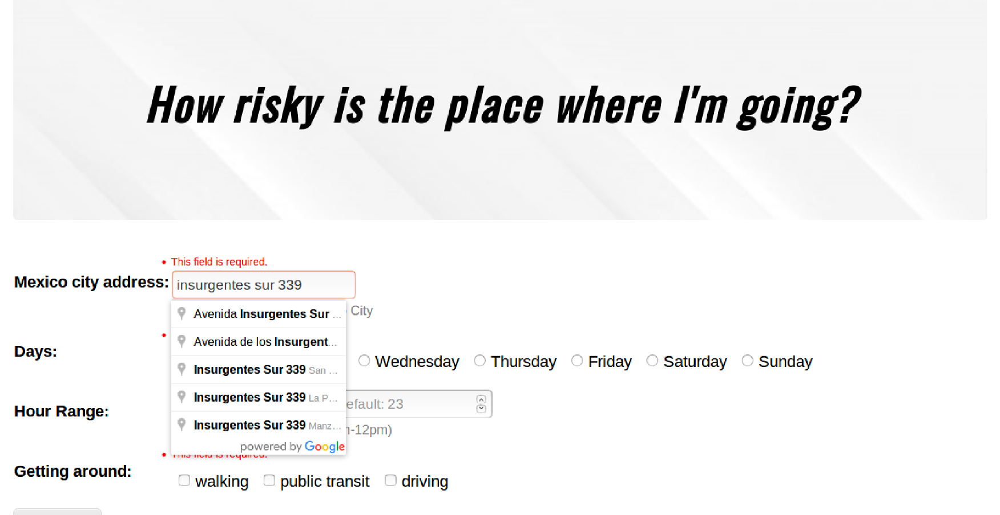
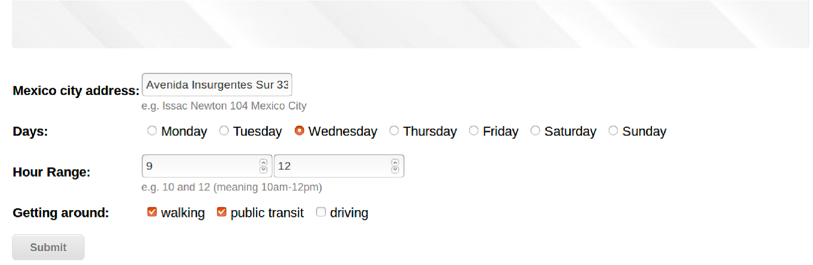
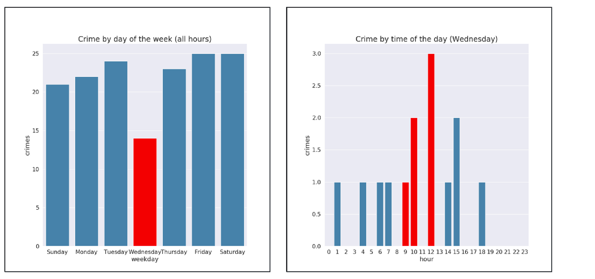
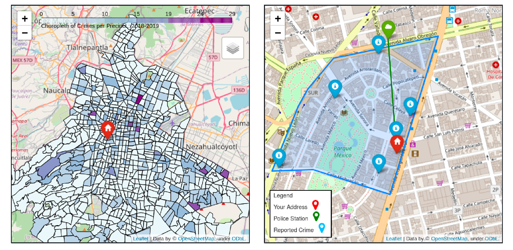
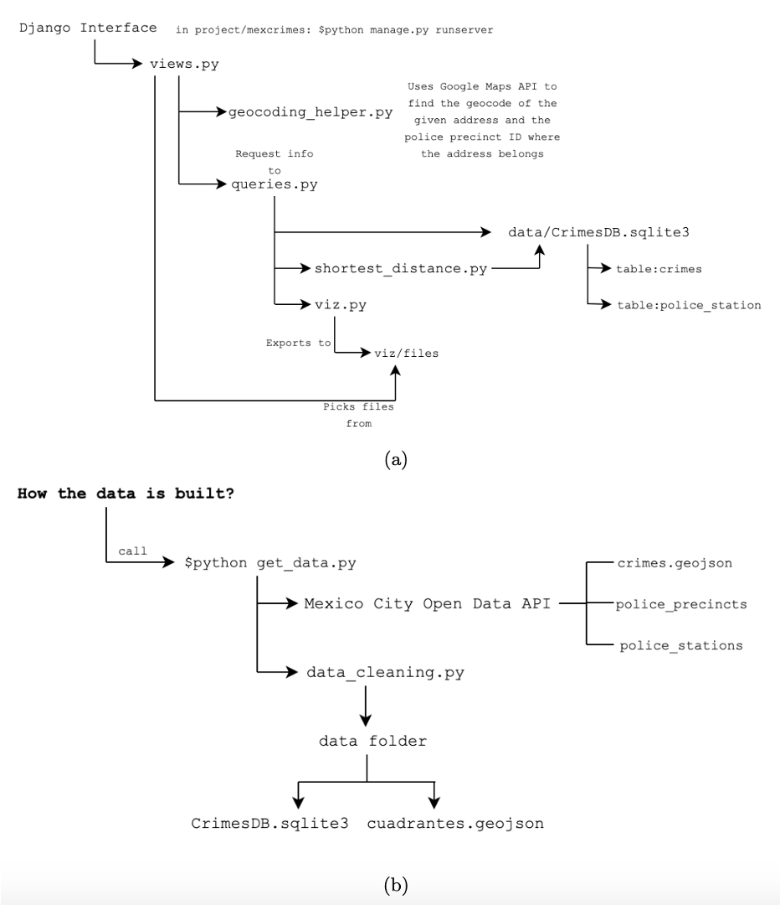

# CAPP 30122: Final Project
# Mapping Crimes at a Certain Day and hour with Mexico City Crime Data (Using DJANGO and SQLITE)

Team:
* Stephanie Ramos
* Oscar Noriega
* Jesica Ramirez


## Table of contents
* [Project overview ](#project-overview)
* [Example of web app](#example-of-web-app)
* [Setup](#setup)
* [Overall Software Structure](#overall-software-structure)
* [Project Accomplishments](#project-accomplishments)
* [Acknowledgements](#acknowledgements)

## Project overview
Motivated by the growing crime incidence in Mexico City (CDMX) which, according to INEGI’s 2019 National Survey of Victimization and Perception on Public Safety was of 69,716 crimes per 100,000 inhabitants, this project aims to provide the user information on the number of crimes that happened at an specified place, day of the week, and hour, with the purpose of the user potentially taking certain precautions when going to a specified area given that time and day of the week.   

To provide a broader context, the application provides two maps:  
* A map of the precinct where the location point belongs, that includes the points where previous crimes were committed on the day and time frame specified by the user. Additionally, it shows the nearest Police Station relative the location provided.
* A map of CDMX divided by precincts to compare the total crimes committed in each precinct at the day and time frame specified by the users. (Darker colors means more crimes)

And two bar graphs showing the number of crimes committed at the precinct of interest:  
* Every day of the week at the specified time frame
* Every hour on the specified day of the week.


## Example of web app
This is an example of the web application using "Av. Insurgentes Sur 339, Hipódromo, Cuauhtémoc, 06100 Ciudad de México, CDMX" as the address. Using Google Places API, as the user writes the address, the API offers some autocomplete options of addresses in Mexico City.


Finally, we select the following inputs of interest: Wednesdays from 9 am to 12 pm, walking or using public transit (this queries crimes related to walking or using public transit).  


  
With the specified inputs, the app provides the following output:  



## Setup
If you want to replicate this web service application, some modules must be installed.
See: [requirements.txt](requirements.txt)
You will also need a Google API key, and substitute the ```YOURKEY``` text in the following files: [geocoding_helper.py](getmaps/geocoding_helper.py) and [mexcrimespage.html](getmaps/templates/mexcrimespage.html).

To run the server simply run ```python3 manage.py runserver``` in the root directory.
After running the server you should be able to visit ```http://127.0.0.1:8000/```

Some interesting locations to try:  
* Plaza de la Constitucin, Centro, Ciudad de Mexico (CDMX’s main square, highly concurred) Any time frame.
* Plan de Barrrancas Mexico between 0 and 4 AM (no crimes reported)
* Hyde Park, Chicago (outside CDMX)
* Insurgentes Sur 339 (Check the spike on Thursdays at 7PM. Usually when people get out of work on Thursdays they go to dinner with coworkers)
Other locations :
* Coscomate 91, Toriello Guerra
* Condor 357, Las Aguilas
* Rio Hondo 1, Altavista
* Camino de Santa Teresa 930, Heroes de Padierna

## Overall Software Structure



**a)Django interface → Calls the module views.py**  
* [views.py](getmaps/views.py) → Returns the rendered site with the output. Calls the modules geocoding_helper.py and queries.py and the visualizations stored in the viz folder.
* [geocoding_helper.py](getmaps/geocoding_helper.py) → Connects to Google Maps API and returns the number of precinct that the input location belongs to.
* [queries.py](queries.py) → Performs the required queries of number of crimes on the crimes SQL database. Also, calls the modules shortest_distance.py and viz.py
* [shortest_distance.py](shortest_distance.py) →includes a function that calculates the distance of the input location (in km.) to all police stations in CDMX and returns the closest one.
* [viz.py](viz.py)→ Produces all four visualizations ( 2 maps and 2 bar graphs)

**b)How data is obtained?**
* [get_data.py](get_data.py) → Connects to Mexico CIty’s Open Data API and obtains crime data from 2018 and 2019, as well as the police precincts delimitation and police stations locations. Calls the module data_cleaning.py, and stores the clean databases on the data folder.  
Run the following and it will download and update the data: ```python3 get_data.py```
* [data_cleaning.py](data_cleaning.py) → Cleans the crimes database filtering by crimes that could affect the user depending on the way they travel.

## Project Accomplishments
We achieved the main goal of showing the relevant visualizations we expected (all mentioned in Project overview) and also show the nearest police station (the term police station is used as equivalent to ”Ministerio Publico”, which is the administrative office where people go to report crimes in CDMX) to the location provided (we noticed there’s a small number).  
**Nevertheless, we weren’t able to normalize the crime number in order to make the different precincts correctly comparable.** For example, touristic areas are usually crowded on the weekends and therefore it’s highly likely that more crimes could be committed in that precinct, therefore, comparing such precinct to a less-crowded one, would not be a correct comparison. This was mainly due to the lack of data on the number of people in a given precinct. While an absolute crime number comparison is still informative on how risky is a precinct in CDMX, crimes committed per X number of inhabitants in a given precinct would be better.

## Acknowledgements
The CAPP 30122 - Winter 2020 Computer Science with Applications 2 Course motivated this project.
We want to thank professor **Lamont Samuels** for his great support and comments.  :blush:
